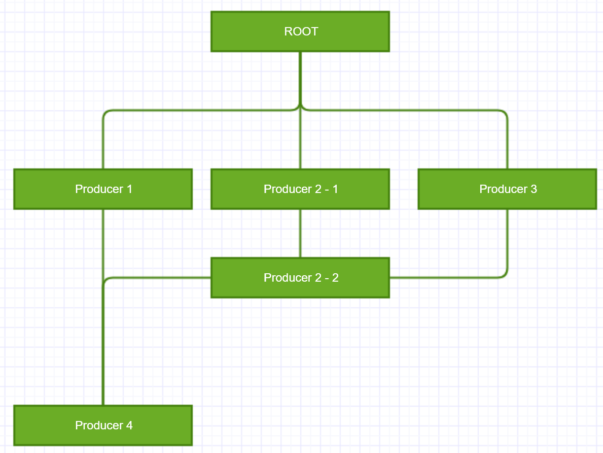

# Workflow manager

[](https://www.npmjs.com/package/@ekifvk/workflow)

Workflow manager is a suit of tools to provide workflow control in javascript. It has:

* Manager to manager workflow
* Producer (abstract class) to produce data
* Relation to descripe relationship between each producer

with features:

* Multiple input / output for all producers
* Asynchronized data stream
* Relations can use javascript code to allow full or part data transfer from one producer to another



For example, in this case, run sequence should be 1 -> 2-1 -> 3 -> 2-2 -> 4 automatically.

#### How to use

0. Install.

        npm install @ekifvk/workflow

1. Create a WorkflowManager.

        const manager = new WorkflowManager();

2. Create some producers.

        const a = new SomeProducer();
        const b = new SomeProducer2();

3. Add relations.

        // last param is the condition, use 'input' to access input data, like 'return input.a === "a"'.
        const relationAB = new Relation(a, b, 'return true');
        a.relation(relationAB); // or b.relation(relationAB)

4. Register entrace.

        manager.entrance = a;

5. Run workflow.

        manager.run(/* input data */).then(...);

#### How to write producer

All producers must extend Producer, which is an abstract class, they must have three function implementations:

```typescript
public abstract initialize(...params: any[]): void;
public abstract parameterStructure(): Parameter[] | null;
public abstract produce(input: any[]): any[] | Promise<any[]>;
```

The initialize function should initialize the producer. The parameterStructure function should return a list of Parameter which defined initialize's parameter structure (still it has no use). The produce function should produce the data and return new data. For example, a producer that returns { key, value } pairs of any object can be like this:

```typescript
export class KeyValuePairProducer extends Producer {
    public initialize(...params: any[]): void { // No parameter
    }

    public parameterStructure(): Parameter[] | null { // Still has no use
        return [] as Parameter[];
    }

    public produce(input: any[]): any[] | Promise<any[]> {
        const result: any[] = [];
        input.forEach(data => { // Map the data
            const keys = Object.keys(data).forEach(key => {
                result.push({ key: key, value: data[key] }); // Find all keys in the object and change to { key, value } pair
            });
        });
        return result;
    }
}
```